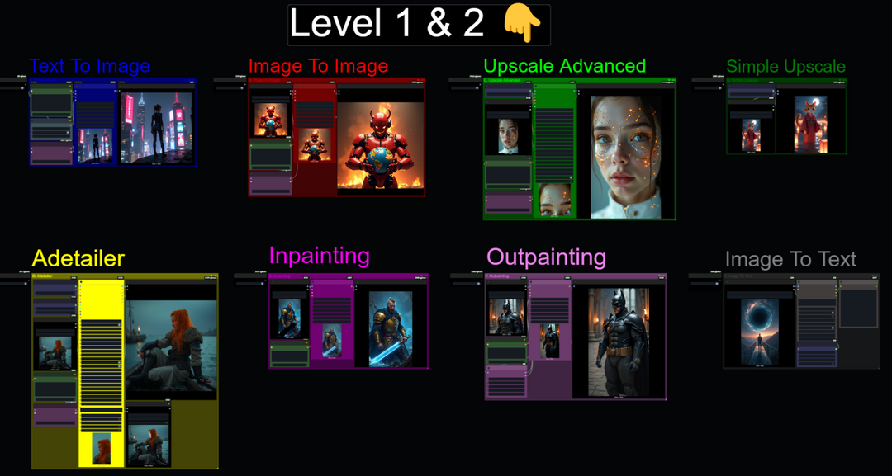

# ComfyUI-MaxedOut

Custom ComfyUI nodes I use in my own Maxed Out workflows (SDXL, Flux, WAN 2.2, and more).


<p align="left">
  
</p>

## Mission

My main goal is to make existing nodes easier to use in the day-to-day especially for my own workflows.

## Overview

- Cleaner UX on frequently used nodes.
- Time-saving presets for common resolutions.
- Image/Video Comparer nodes with easy save.
- Advanced Wan 2.2 nodes for my Patreon exclusive workflows.

## Install

ComfyUI Manager (Recommended):

Open Manager (top-right in ComfyUI), search `Maxed Out`, install, then restart ComfyUI.

Manually:

```powershell
cd ComfyUI\custom_nodes
git clone https://github.com/Maxed-Out-99/ComfyUI-MaxedOut.git
```

Restart ComfyUI after install.

## Featured Nodes

| Node | What it does |
|---|---|
| `Lora Loader MXD` | Based on rgthree Power LoRA Loader. Fixes copy/paste issues, surfaces useful info/remove buttons, and keeps local LoRA info files organized. |
| `Image Comparer + Save MXD` | Compare original vs new images in-node and save the new result easily. |
| `Video Comparer MXD` | Similar to Image Comparer but for video. |
| `Flux Empty Latent Image MXD` / `ZIT Empty Latent Image MXD` / `SDXL Empty Latent Image MXD` | Resolution presets plus vertical toggle to avoid retyping the same sizes repeatedly. |
| `Save Image MXD` | Simple save modes (`Save + Preview`, `Save Only`, `Preview Only`). |
| `WAN 2.2 MXD` nodes | Helpers for WAN 2.2 latent/video prep, frame tools, and I2V-focused workflows. |

## Free Workflows

Free workflow releases are posted on Patreon (no sign up needed).

- [SDXL v1.5 Here](https://www.patreon.com/posts/free-sdxl-v1-5-129782694?utm_medium=clipboard_copy&utm_source=copyLink&utm_campaign=postshare_creator&utm_content=join_link)


- [Flux v1.5 Here](https://www.patreon.com/posts/free-flux-just-131945103?utm_medium=clipboard_copy&utm_source=copyLink&utm_campaign=postshare_creator&utm_content=join_link)



## Credits

Huge thanks to these projects. I have learned a lot from them and built on many of their ideas:

- https://github.com/rgthree/rgthree-comfy
  Inspiration for LoRA Loader, Image/Video Comparer, and more.
- https://github.com/kijai/ComfyUI-KJNodes
  Major reference and inspiration for my own nodes.

If you star this repo, definitely consider starring theirs too.
